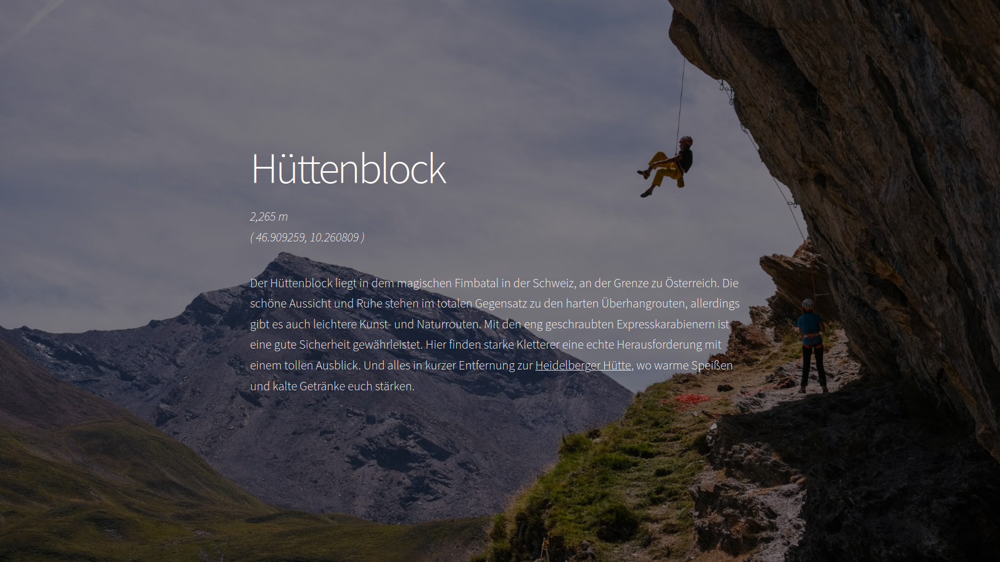

# Hüttenblock [https://hüttenblock.com/](https://hüttenblock.com/)

[](https://app.netlify.com/sites/huttenblock/deploys)

This website aims to provide detailed information about the climbing wall known as "Hüttenblock," located in the picturesque Alps next to the Heidelberger Hütte.



It is built using [HUGO](https://gohugo.io/) uses the [Hugo Story](https://caressofsteel.github.io/demos/hugo/hugo-story/#) theme.

## Features

- **Overview**: Description and history of the Hüttenblock.
- **Topo**: Detailed [climbing topo](https://en.wikipedia.org/wiki/Topo_(climbing)) showing each climbing route.
- **Route Grades**: Name and difficulty rating for each route.
- **Location Guide**: Find detailed directions and maps to help people reach the Hüttenblock.
- **Photo Gallery**: Photos of the climbing wall and surrounding scenery.

## Development

### Prerequisites

- [Hugo](https://gohugo.io/getting-started/installing/)

### Quick Start

```bash
# 1. Clone this repository
git clone git@github.com:01100100/blog.git
# 2. Install the theme
git submodule update --init --recursive
# 3. Run the server
hugo server --disableFastRender
```

The website will be available at `http://localhost:1313/`.

## Pre-commit Hooks

This project uses pre-commit hooks to ensure code quality and consistency. The configuration is defined in `.pre-commit-config.yaml`.

To set up pre-commit hooks, run the command

```sh
pre-commit install
```

## Hosting

This blog is hosted using [Netlify](https://www.netlify.com/). The deployment is triggered automatically when a new commit is pushed to the `main` branch. Preview deploys are triggered when a pull request is opened.
